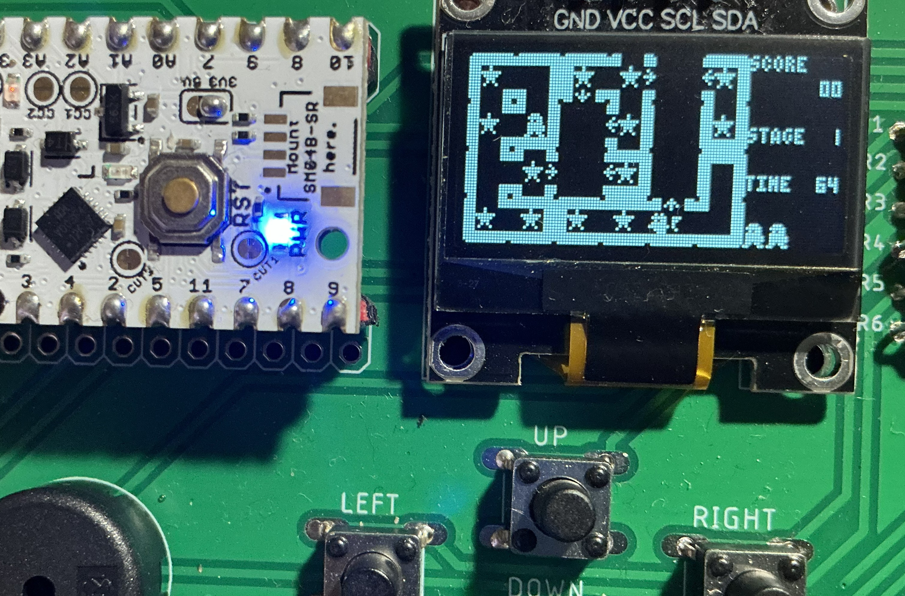

# UIAPduino+SSD1306版 Svellas mini

並んだパネル上の通路を通って、星を全て取るとクリアーです。  
パネルを動かすことで、通路を繋ぎ変えたり離れたパネルの間を渡ることができます。

## 操作

|操作|割り当て|
|-|-|
|移動|UP, DOWN, LEFT, RIGHT|
|パネルの移動|矢印を踏んでACT|

## 動作確認済みハードウエア

* [UIAPduino開発支援ボード](http://www.picosoft.co.jp/CH32V/)  
USB給電の場合はUIAPduinoの電圧選択ジャンパーを3.3Vにしてください。
"# UIAPduino_svellas" 
